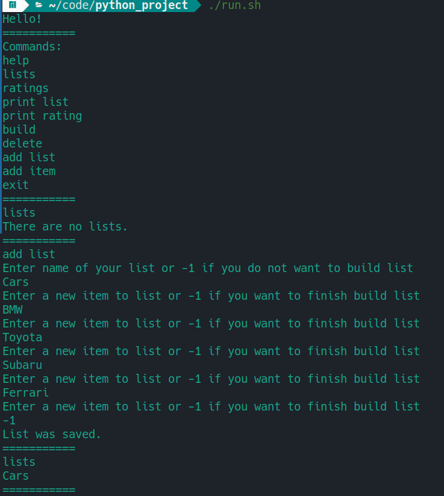
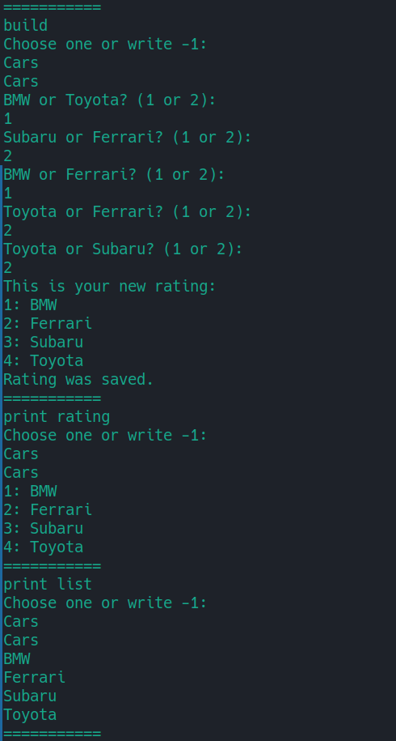
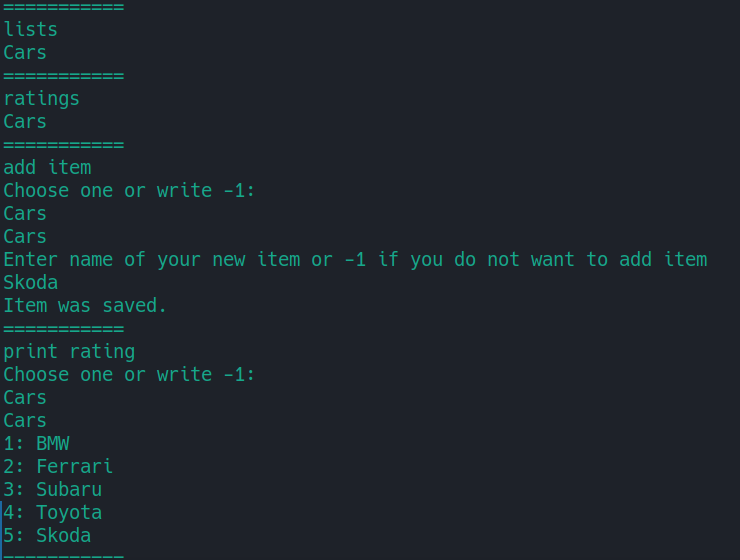

# Система рейтинга

### Установка и запуск (на Ubuntu может потребоваться выполнить `sudo apt install libxcb-xinerama0` перед установкой):
```
git clone git@github.com:kirillnyunenkov/rating_system.git
cd rating_system
chmod +x install
chmod +x run
./install
./run
```

  

## Команды
С помощью команды `help` пользователь получает список всех возможных комманд, с помощью которых он может пользоваться 
приложением.

Пользователю предлагается составлять рейтинги на основе списков которые пользователь может добавить сам (или на основе списков 
других пользователей, если они поделятся файлом с базой данных).

Везде присутствует возможность добавления логики работы с разными пользователями, но сейчас все пользователи - default (сделано 
для простой возможности расширения).

Создание своего списка рейтинга происходит пошагово (команда `add list`). Пользователь пишет названия элементов нового списка. 
После добавления всех элементов, список сохраняется и будет доступен для просмотра и сортировки.

Пользователь имеет возможность отсортировать свои списки для рейтинга (команда `build`). Ему будет предлагаться выбор между 
двумя элементами списка, которые будут выбираться с помощью merge sort. Этот алгоритм позволит сделать линейно-упорядоченное 
множество в соответствии с предпочтениями пользователя. После работы алгоритма пользователь сможет посмотреть получившийся 
рейтинг, который будет отображать названия элементов списка в нужном порядке. При необходимости, этот рейтинг можно 
будет отсортировать еще раз.

Пользователь может в любой момент посмотреть все свои списки и рейтинги (команды `lists` и `ratings`), а также их 
содержимое (команды `print list` и `print rating`).

Есть возможность добавить новый элемент в список (команда `add item`). Он по умолчанию добавится на последнее место рейтинга, 
если он былсформирован.

Есть возможность удалить список (команда `delete`), который выберет пользователь.

Все данные хранятся в базе данных (файл `data.db`), которая управляется с помощью SQLite.

Выход из программы осуществляется с помощью команды exit.

На доп. баллы: планируется неконсольный UI и всякие плюшки к нему.

P.S.
Хотел отделить UI от логики программы, пока получилось не очень, но к следующей итерации поправлю.
